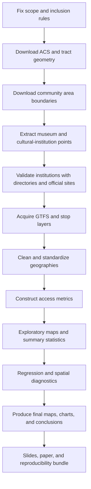
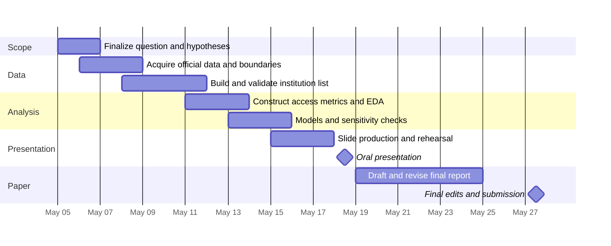

# Research Plan for Spatial Equity of Museum Access in

## Executive Summary

This plan is no longer generic: it can now be tailored directly to the uploaded rubric and initial project idea. The rubric rewards a clearly stated thesis or problem statement, explicit hypotheses, a literature review using at least two to three similar studies, appropriate GIS methods and data, analysis supported by original maps, and a clear conclusion. For the highest rubric tier, the project should include at least two original maps, and the course schedule fixes the oral presentation for May 18 and the written report for May 27; the paper should usually be about four to eight pages and must not exceed fifteen pages excluding figures. Your initial idea already gives the project a strong substantive core: testing whether museums and cultural institutions are spatially equitably distributed across neighborhoods in relation to income, race and ethnicity, poverty, density, car ownership, and possibly transit reach. fileciteturn0file0 fileciteturn0file1

The strongest version of the project is a **cross-sectional spatial equity study** with census tracts as the main analytical unit and community areas as the communication unit. That design fits the available demographic data, stays manageable under the course timeline, and preserves enough rigor to support geospatial and statistical analysis. The recommended core data stack is: recent American Community Survey tract data, official tract geometry, current community area boundaries, a validated museum and cultural-institution inventory built from official and semi-official directories plus an open point dataset, and an optional transit accessibility layer built from scheduled transit data and stop locations. Recent ACS 5-year data products are available down to census tracts, TIGER/Line files provide official geometry keyed by GEOID, Chicago community area boundaries are available through the city data portal, and CTA publishes GTFS scheduled-service data and related stop datasets. citeturn2view2turn0search8turn2view3turn26search12turn0search2turn2view1turn2view7

If time becomes tight, the **minimum viable excellent project** is still very achievable: one validated institution inventory, one tract-level demographic-access dataset, one defensible accessibility metric, one short regression or group-comparison table, and **three polished figures**, of which at least two are original maps. The most persuasive core deliverables would be a citywide museum distribution map, a tract-level accessibility map, and a bivariate or equity-gap map pairing access with poverty or no-vehicle households. That package maps directly onto the rubric’s thesis, methods, analysis/maps, and conclusion criteria while staying within the short page limit by moving technical detail into appendices or a reproducibility repository. fileciteturn0file0

## Study Framing

The rubric allows either a conventional research paper or an applied GIS project, but your topic already contains both a guiding question and a preliminary hypothesis. That means the strongest framing is a **research-paper structure** with a clear thesis, hypotheses, data/methods section, findings, and conclusion, while retaining an applied fallback if the final analysis is more descriptive than causal. Your initial idea also points toward a tract-plus-community-area workflow: use census tracts for inference because ACS tract data are readily available, and use community areas for cleaner local interpretation. I do **not** recommend using the city’s general neighborhood boundary file as the primary analytical geography, because the portal explicitly notes that those neighborhood boundaries are approximate and their names are not official. fileciteturn0file0 fileciteturn0file1 citeturn2view2turn0search10turn0search2

The remaining assumptions that still need to be fixed are relatively narrow. The geographic study area is clearly Chicago. What remains unspecified is the temporal frame, the exact definition of “museum and cultural institution,” the access thresholds to test, and whether the transit component is core or optional. My recommendation is to define the main study as a **current cross-sectional snapshot** using the latest available ACS 5-year release and a versioned transit feed or stop layer captured once and archived; then treat historical change as a stretch extension only if time remains. ACS 2020–2024 5-year tables are currently available, and CTA notes that its GTFS package updates regularly, which makes version control essential. citeturn0search8turn2view2turn2view1

### Plausible research objectives and questions

| Option | Status | Why it is useful | Assumption burden |
|---|---|---|---|
| **Measure whether museum access differs across tracts by income, poverty, race/ethnicity, and car ownership** | **Recommended core objective** | Closest fit to the initial idea and easiest to defend statistically | Low |
| **Compare simple proximity with network and transit accessibility** | **Recommended extension** | Shows whether straight-line buffers miss meaningful mobility differences | Moderate |
| **Test whether some community areas are “cultural access gaps” after controlling for density and downtown proximity** | **Recommended robustness check** | Moves beyond descriptive mapping into tract-level inference | Moderate |
| **Compare narrow museum-only access with broader cultural-institution access** | **Strong sensitivity analysis** | Helps show that results are not an artifact of one institution definition | Moderate |
| **Add a temporal before/after or multi-year component** | **Stretch only** | Interesting if historical archives become available | High |

A strong thesis statement for the paper would be:

**Access to museums and cultural institutions in Chicago is not spatially even; neighborhoods with lower income, higher poverty, larger transit-dependent populations, and larger Black or Hispanic populations are expected to have lower geographic and transit-based access, and those inequities are likely to appear more clearly when access is measured using network or transit travel time rather than simple straight-line distance.** fileciteturn0file1

A defensible hypothesis set would be:

1. **H1.** Museums are more spatially concentrated in central, lakefront, and tourist-oriented parts of the city than in many South and West Side areas. This is drawn directly from your initial idea. fileciteturn0file1  
2. **H2.** Census tracts with lower median household income, higher poverty, and higher shares of households without vehicles will have worse museum access scores. This is an analytical extension of your proposed demographic comparison. fileciteturn0file1  
3. **H3.** Associations between access and neighborhood inequality will be stronger for **network/travel-time** measures than for simple Euclidean buffers. This is a methodological hypothesis based on current accessibility scholarship. citeturn12search0turn12search12  
4. **H4.** Results will vary meaningfully depending on whether the institution universe is defined narrowly as museums only or more broadly as museums, galleries, and arts centers. This follows directly from the available source structure and the mixed tagging/classification landscape. citeturn19search0turn19search1turn19search2turn17search2turn18search1

### Literature anchors for the required review

| Anchor study | What it contributes to your paper |
|---|---|
| Brook (2016), *Spatial equity and cultural participation* | Directly relevant precedent: it asks how access influences attendance at museums and galleries, giving you a conceptual bridge between spatial distribution and cultural participation. |
| Hong et al. (2026), *Perceived Museum Accessibility as a Sequential Urban Experience* | Useful for arguing that museum access is not only about distance; experience and trip sequencing matter, which supports using multimodal or time-based measures. |
| Chen (2025), *A GIS-Based Study on Spatial Pattern, Accessibility and Equity of Urban Cultural Resources* | Very close methodological parallel for spatial pattern mapping and equity-oriented accessibility analysis of cultural resources. |
| Liu et al. (2022), *Realizable accessibility* or a similar transit accessibility paper | Supports the view that transit accessibility should be interpreted carefully because schedule-based access and realized access are not identical. |

The literature anchor list above is grounded in publicly surfaced research records and abstracts or snippets that are close enough to your topic to support a short but credible course-level literature review. Use the first three as the minimum set; use the transit paper as a methodological fourth source if you keep the CTA component in scope. citeturn13search0turn13search9turn12search0turn12search24turn12search12

## Data Strategy

An official-first data strategy is both feasible and defensible here. The demographic, tract, and city-boundary layers should come from official public sources. The only domain where a hybrid strategy is necessary is the **institution inventory**, because the most suitable point-level museum/cultural-asset universe is unlikely to come from one single official geocoded source. The plan should therefore prioritize official sources where they exist and explicitly document where open civic or sector directories are being used to fill that gap. citeturn2view2turn2view3turn0search2turn2view6turn2view1turn2view4turn17search2turn18search1

### Candidate core data sources

| Dataset | Provider | Recommended role | Spatial / temporal resolution | Key fields to seek | Terms / licensing posture | Priority |
|---|---|---|---|---|---|---|
| ACS 2020–2024 5-year tables and profiles | entity["organization","U.S. Census Bureau","federal statistics agency"] | Core demographics and socioeconomic covariates | Census tract; 5-year pooled estimates | Population, income, poverty, race/ethnicity, no-vehicle share, transit commuting share, MOEs | Publicly downloadable federal data; cite source and preserve MOEs | Critical |
| TIGER/Line census tracts | same provider | Official tract geometry for joins and mapping | Census tract; current official vintage | GEOID, tract boundary geometry, land area | Publicly downloadable official geography | Critical |
| Community Areas boundary layer | entity["organization","City of Chicago","municipal government"] | Local reporting geography for map communication and aggregation | Community area; current city boundary product | Community area name/ID, polygon geometry | City open-data portal and terms of use | Critical |
| GTFS scheduled-service feed | entity["organization","Chicago Transit Authority","transit agency"] | Door-to-door or stop-to-stop transit accessibility extension | Feed snapshot; route-trip-stop-time level | stops, routes, trips, stop_times, shapes, transfers | CTA developer agreement / terms of use | High |
| Bus stop and rail-station point datasets | CTA / city portal | QA layer for stop geography, transit map overlays, simpler proximity analyses | Stop/station points; current snapshots | stop_id, coordinates, accessibility/service fields where available | Open data portal + provider terms | High |
| Museum / cultural institution point inventory | entity["organization","OpenStreetMap","mapping platform"] | Base point layer for institutions and street-network context | Point or polygon features; extraction-date snapshot | name, geometry, website, operator, tags | ODbL attribution and share-alike obligations | High |
| Museum / culture directory pages | entity["organization","Choose Chicago","tourism bureau"] | Validation supplement, especially for visitor-facing museums and neighborhood attractions | Listing pages; extraction-date snapshot | institution name, neighborhood, URL, address where listed | Use as reference/validation rather than canonical redistributable data | Medium |
| Cultural heritage organization list | entity["organization","Chicago Cultural Alliance","cultural consortium"] | Validation supplement for heritage centers and community-rooted institutions | Member list; extraction-date snapshot | institution name, URL, mission/category | Use as reference/validation and inclusion check | Medium |
| Optional rail ridership dataset | CTA / city portal | Contextual extension for interpreting transit-service demand near museum clusters | Station-day observations | station name, date, entries | Optional context only | Low |

Source note: recent ACS 5-year data are available down to tracts, and detailed tables reach block groups; 2020–2024 profiles are currently available; TIGER/Line files provide official tract geometry and GEOIDs that can be linked to Census data; the city portal provides community-area boundaries and transit datasets; CTA’s GTFS feed contains stops, routes, trips, stop_times, shapes, and transfers and is distributed with a license/terms file; the bus-stop and rail-station datasets are also exposed through the city portal; OpenStreetMap data are ODbL-licensed; Choose Chicago and Chicago Cultural Alliance provide useful institution lists for validation. citeturn2view2turn0search8turn2view3turn26search12turn0search2turn2view6turn2view1turn2view7turn11search6turn11search11turn11search5turn2view4turn17search2turn17search14turn18search1

### Candidate museum and cultural-institution source comparison

| Source | Strengths | Main risks | Best use in this project |
|---|---|---|---|
| OpenStreetMap | Geocoded, queryable, downloadable, includes tags for museums, galleries, and arts centers | Coverage and tagging inconsistency; community-generated rather than official | **Base spatial inventory** |
| Choose Chicago | Curated visitor-facing directory spanning major museums and neighborhood attractions | Tourism emphasis may underrepresent less visitor-oriented institutions | **Validation layer and missing-institution check** |
| Chicago Cultural Alliance | Better coverage of heritage museums and cultural centers embedded in neighborhoods | Membership-based rather than exhaustive citywide universe | **Equity-sensitive validation layer** |
| Individual institution websites | Best source for final confirmation of existence, address, hours, and admission | Slow and manual | **Final audit of included institutions** |

Source note: OpenStreetMap’s museum, gallery, and arts-centre tagging structure supports a narrow-versus-broad institution universe; Choose Chicago explicitly presents both must-see museums and neighborhood cultural attractions; and Chicago Cultural Alliance maintains a member list of heritage-focused organizations that may not be prominent in tourist directories. citeturn19search0turn19search1turn19search2turn17search2turn17search14turn18search1

### Prioritized acquisition list

| Acquisition order | Dataset or task | Why it comes first | Stop / go decision |
|---|---|---|---|
| First | Lock inclusion rule for “museum” and “cultural institution” | Prevents downstream scope drift | Proceed only after narrow and broad definitions are both written down |
| Next | ACS tract tables + TIGER tract geometry | Everything else depends on this joinable demographic backbone | Proceed only after GEOID joins succeed |
| Next | Community areas boundary | Needed for reporting and aggregation | Proceed once tract/community overlay is checked |
| Next | OSM institution extract | Establishes the base point universe early | Proceed once duplicates and obvious false positives are identified |
| Next | Choose Chicago and Chicago Cultural Alliance validation pulls | Needed to patch omissions and broaden equity-sensitive coverage | Proceed once unmatched institutions are reviewed |
| Next | CTA GTFS + stop/station layers | Only needed if transit access is kept in scope | Proceed if time budget allows a transit extension |
| Last | Optional station ridership, hours, admission cost, museum categories | Adds nuance but is not essential to a strong course project | Treat as stretch only |

## Analytic Design

The cleanest analytical design is a **current, citywide, tract-level accessibility study** with community-area rollups for communication. Use census tracts as the inferential unit because recent ACS tables are published there, and use community areas as the narrative geography because they are locally legible and avoid the city’s approximate, non-official neighborhood layer. When tract-level estimates prove noisy, the Census Bureau’s own guidance on margins of error supports statistical testing, caution with high-MOE estimates, and aggregation to larger geographies where necessary. citeturn2view2turn0search10turn16search1turn16search2turn16search8turn16search9

### Key variables and operationalization

| Construct | Preferred variable(s) | Operationalization |
|---|---|---|
| Population | `B01003_001E` | Total tract population; also denominator for population-weighted summaries |
| Median income | `B19013_001E` or `DP03_0062E` | Use median household income; log-transform if needed for models |
| Poverty | `DP03_0128PE` or `B17001_002E / B17001_001E` | Use poverty rate as the main covariate; retain MOE |
| Black population share | `B02001_003E / B02001_001E` | Continuous tract share |
| White population share | `B02001_002E / B02001_001E` | Optional descriptive comparator |
| Hispanic or Latino share | `B03003_003E / B03003_001E` | Continuous tract share |
| No-vehicle households | `DP04_0058PE` or `B08201_002E / B08201_001E` | Core transportation-equity variable |
| Transit commute share | `DP03_0021PE` | Optional mobility-context covariate |
| Population density | `B01003_001E / tract land area` | Derived control for urban form and centrality |
| Museum access | derived | Nearest distance/time, count within threshold, and/or coverage ratio |
| Transit museum access | derived from GTFS + walk network | Scheduled weekday and Saturday travel time to nearest institution |

Source note: the variable recommendations above are based on current ACS 5-year group and profile metadata for total population, median household income, poverty, race, Hispanic origin, no-vehicle households, and public-transportation commute share. citeturn10view0turn8view1turn23view0turn8view3turn9view0turn24view0turn22view0

The preprocessing sequence should be explicit and versioned:

1. **Freeze the analytic time window.** Record one download date for ACS/TIGER, one extraction date for the institution inventory, and one archived GTFS feed date if transit is included.  
2. **Standardize coordinate systems.** Keep analysis in a local projected CRS appropriate for Chicago distance calculations; reserve web Mercator only for web display if needed.  
3. **Build two institution universes.** A **narrow** universe should include museum-only points; a **broad** universe should add galleries, arts centers, and verified heritage institutions.  
4. **Deduplicate institutions.** Remove repeated points using name, address, website, and spatial proximity; manually adjudicate borderline cases.  
5. **Validate the institution list.** Cross-check OSM against Choose Chicago, Chicago Cultural Alliance, and official institutional websites.  
6. **Join tract demographics carefully.** Preserve ACS estimates **and** margins of error in the working files rather than stripping them out.  
7. **Construct access metrics.** Produce Euclidean distance, network walking distance or time, threshold coverage, and if feasible a scheduled transit travel-time metric.  
8. **Aggregate only after QA.** Create community-area summaries after the tract analysis is stable, using area- or population-weighted methods rather than casual centroid assignment.

That sequence is especially important because ACS comparisons should account for margins of error, the Census Bureau recommends formal statistical testing rather than eyeballing differences, large MOEs may require larger geographies, and CTA’s GTFS feed changes over time and is packaged with its own license/terms materials. citeturn16search1turn16search2turn16search8turn16search9turn2view1turn2view7

The exploratory data analysis plan should go well beyond a few choropleths. Start by mapping raw institution locations and inspecting obvious clustering patterns. Then summarize the distribution of tract-level access measures, identify outliers, compare high- and low-access quartiles, and examine bivariate relationships with income, poverty, race/ethnicity, and no-vehicle share. Every tract-level summary should be produced twice: once unweighted for geography and once population-weighted for equity interpretation. This is where you also decide whether the broad and narrow institution universes materially change the geography of “access.” citeturn13search0turn12search24turn19search0turn19search1turn19search2

For statistical and geospatial analysis, I recommend a **layered method stack** rather than a single model. Begin with descriptive and spatial methods: nearest-neighbor distance, institution counts per tract or catchment, kernel density or point-density mapping, and a basic global or local spatial autocorrelation check on the tract access score. Then estimate one main tract-level model with an accessibility score as the dependent variable and socioeconomic variables as predictors. If the accessibility score is continuous, use weighted OLS first; then test residual spatial autocorrelation with Moran’s I and, if needed, move to a spatial error or spatial lag model. If you instead model counts of museums within a thresholded catchment, use a count model such as negative binomial. If you model whether a tract clears a policy threshold such as “within a 15-minute walk” or “within a 30-minute transit trip,” logistic regression is appropriate. In every case, run robustness checks for the narrow versus broad institution universe and for alternative thresholds such as 0.5 mile, 1 mile, 15-minute walk, or 30-minute transit travel. The literature anchors above justify this mix of access, equity, and transit-sensitive methods. citeturn13search0turn12search0turn12search24turn12search12

Sampling is straightforward because the main analysis should use a **full spatial census**, not a sample: all institutions in the final validated inventory and all city tracts should be included. The only place where sampling is needed is **validation**. If the final institution universe is under about 100 sites, manually validate all of them. If it is larger, validate all ambiguous sites plus a stratified audit sample by geography and source type. For transit validation, spot-check a small set of origin–destination pairs against the official trip planner to confirm that your scheduled travel-time routines are directionally reasonable. For ACS reliability, keep MOEs in the dataset and document where tracts were aggregated or flagged for weak reliability. citeturn16search1turn16search2turn16search9turn2view1

## Maps and Visualizations

Because the rubric explicitly values analysis plus original maps, figures should carry a large share of the final paper’s analytical burden. In practice, that means designing the project around **three to four strong visuals** rather than trying to cram too much prose into a short paper. The minimum should still be at least two original maps, but a stronger package is three maps plus one chart-backed regression or comparison figure. fileciteturn0file0

### Maps and charts to produce

| Output | Main layers | Symbology and design | Scale / projection guidance | Why it matters |
|---|---|---|---|---|
| Citywide institution distribution map | Institution points, community areas, water/body outline | Small uniform points; optional symbol by type; muted boundary lines | Citywide print scale; local projected CRS for production | Establishes spatial pattern immediately |
| Tract accessibility choropleth | Tracts colored by nearest walk time or access score; institution points faintly overlaid | Sequential colorblind-safe ramp, 5–7 classes | Citywide + optional inset for central area | Main result figure for inequity geography |
| Bivariate equity map | Tracts coded by access + poverty or no-vehicle share | Bivariate scheme with carefully documented legend | Citywide | Shows whether disadvantage and low access coincide |
| Transit access map | Transit isochrones or tract-level transit access score; CTA lines/stops; institutions | Distinct line styling for rapid transit; avoid clutter | Citywide with inset | Demonstrates whether transit mitigates or reproduces gaps |
| Community-area summary map | Community areas colored by average tract access or gap index | Simple sequential ramp; labels on selected areas | Citywide | Better storytelling for local audiences |
| Point-density or KDE map | Institution density surface | Monochrome or single-hue density surface | Citywide | Useful descriptive companion, especially for presentation |
| Boxplots / violin plots | Access score by income quartile, poverty quartile, or no-vehicle quartile | Simple statistical summary | N/A | Makes distributional inequity legible |
| Coefficient plot | Regression coefficients or marginal effects | Dot-whisker plot | N/A | Turns statistical results into a readable figure |

When you prepare slides or an appendix, explicitly request **illustrative mockups or sample visual outputs as images** for the point map, tract accessibility choropleth, bivariate equity map, and transit isochrone figure. Use them as design references, not as evidence.

image_group{"layout":"carousel","aspect_ratio":"16:9","query":["Chicago community areas map","bivariate choropleth map example urban equity","public transit isochrone map example GIS","city point map museums example"],"num_per_query":1}

A sensible cartographic specification is to keep the analysis layers in a local projected CRS, use simple neutral basemap elements, and avoid red–green contrasts for accessibility. Printed report figures should include one citywide map, one inset if the downtown core is visually crowded, one compact scale bar, one data-source note, and one explicit statement about whether the institution universe is narrow or broad. For the bivariate map, poverty or no-vehicle share are stronger second variables than raw race alone, because they more directly connect the spatial equity framing to access burden while still allowing race and ethnicity to be treated rigorously in the statistical section.

The workflow below is formatted as Mermaid so it can be dropped directly into a proposal, a Quarto report, or GitHub documentation.



## Reproducibility and Ethics

Because budget was not specified, the software recommendation should be **open-source by default**. A strong stack would be QGIS for QA and cartography; R with `sf`, `tidycensus`, `tigris`, `osmdata`, `tidytransit`, `gtfsrouter`, `ggplot2`, `tmap`, `spdep`, and `spatialreg`; and/or Python with `geopandas`, `pandas`, `osmnx`, `networkx`, `partridge` or `gtfs-kit`, `libpysal`, `esda`, `spreg`, `statsmodels`, and `matplotlib`. For larger joins or more reproducible pipelines, add DuckDB or PostGIS. For writing, Quarto is ideal because the paper, appendix, and slide deck can be generated from the same project directory.

The project should use a strict folder structure so that raw downloads, cleaned files, analysis scripts, and final outputs are separable and recoverable.

```text
museum_access_chicago/
├── README.md
├── environment.yml
├── renv.lock
├── data/
│   ├── raw/
│   │   ├── census/
│   │   ├── city_portal/
│   │   ├── cta/
│   │   └── osm/
│   ├── interim/
│   ├── processed/
│   └── metadata/
├── scripts/
│   ├── 01_acquire/
│   ├── 02_clean/
│   ├── 03_access_metrics/
│   ├── 04_analysis/
│   └── 05_maps/
├── outputs/
│   ├── figures/
│   ├── tables/
│   ├── slides/
│   └── paper/
└── docs/
    ├── methodology_notes/
    └── qa_logs/
```

A clean naming convention prevents chaos once figures and revisions multiply. Use a pattern such as:

**`YYYYMMDD_place_theme_geography_stage_v##.ext`**

Examples:

- `20260506_chicago_acs_tract_raw_v01.csv`
- `20260508_chicago_museum_inventory_interim_v02.gpkg`
- `20260510_chicago_access_tract_processed_v01.parquet`
- `fig_01_chicago_museum_distribution_v03.png`
- `tbl_02_access_regression_v01.csv`

The reproducibility plan should also define **shareable outputs** versus **script-only outputs**. Census data and official city portal datasets are publicly downloadable and should be cited clearly. CTA data offerings are distributed under developer terms, and the GTFS package itself includes license/terms materials; OpenStreetMap data are ODbL-licensed and require attribution plus attention to share-alike requirements if you publicly redistribute an adapted database. The safest practice is therefore to share: download scripts, exact extraction dates, metadata, and cleaned derivatives where redistribution is permitted; and to archive a machine-readable data dictionary plus README and provenance log for every derived file. Census also explicitly asks users to cite the Bureau as the source of the original data when they create their own estimates or analyses. citeturn2view6turn2view7turn2view1turn2view4turn26search3turn26search9

For metadata, use one human-readable `README.md`, one `data_dictionary.csv`, and one machine-readable `metadata.yml` or `metadata.json` per processed dataset. For geospatial layers, document CRS, source name, download date, original file name, join keys, any dissolves or spatial joins, and whether tract estimates were aggregated or interpolated. If you publish the project, version-control the entire repository with Git and archive a release to a long-term service such as Zenodo or OSF.

The ethical and privacy considerations here are real even though most data are aggregated. The project should not imply that residents are culturally disengaged because of where they live; it should instead analyze whether the geography of institutions and mobility networks structures opportunity. Institution definitions can also privilege large, formal, downtown-facing museums over smaller neighborhood heritage spaces, which is exactly why the narrow-versus-broad institution sensitivity analysis matters. OSM coverage may be stronger in some neighborhoods than others, and scheduled transit accessibility is not the same as realized accessibility under delay, safety, disability, childcare, or cost constraints. Those limitations do not undermine the project; they need to be named clearly in the discussion section as part of a fair equity analysis. citeturn12search12turn19search0turn19search1turn19search2

## Timeline and Deliverables

The timeline should be built backward from the fixed course deadlines: oral presentation on May 18 and final report on May 27. Because the written paper is short, the project should prioritize a stable dataset and polished visuals more than a sprawling set of exploratory detours. fileciteturn0file0

| Window | Main tasks | Estimated duration | Deliverable |
|---|---|---:|---|
| May 5–6 | Finalize research question, thesis, hypotheses, institution definitions, and figure plan | 2 days | 1-page study design memo |
| May 6–8 | Download ACS, TIGER tracts, community areas, OSM extract, validation directories | 3 days | Raw-data inventory + metadata log |
| May 8–11 | Clean data, deduplicate institutions, validate inventory, build tract joins | 4 days | Working analytic dataset |
| May 11–13 | Construct access metrics, run EDA, identify preferred map designs | 3 days | Draft maps + summary stats |
| May 13–15 | Run models, diagnostics, and sensitivity checks | 3 days | Final core findings |
| May 15–17 | Build presentation slides and rehearse | 3 days | Slide deck with 2–4 maps |
| May 18 | Give oral presentation | 1 day | Presentation delivered |
| May 19–24 | Revise analysis from presentation feedback; draft paper | 6 days | Near-final paper |
| May 25–27 | Edit, tighten prose, finalize conclusion, polish repo and appendices | 3 days | Final paper + reproducibility package |

The Mermaid timeline below is ready to paste into a proposal or project repository.



The minimum deliverable package should include: one thesis paragraph; one short literature review using at least three anchor studies; one methods section; one tract-level descriptive table; one inferential or comparison table; at least three figures including two original maps; one limitations paragraph; one conclusion; one reproducibility appendix or repository summary. That package is realistic inside the course window and tightly aligned with the grading rubric. fileciteturn0file0

## Limitations and Contingencies

| Limitation | Why it matters | Contingency plan |
|---|---|---|
| No single official, geocoded museum inventory | Can undermine claims if the institution universe is poorly defined | Use a hybrid inventory: OSM base + Choose Chicago + Chicago Cultural Alliance + manual website checks |
| Museum definition is contestable | Results can change depending on whether galleries or arts centers are included | Report both narrow and broad institution universes |
| Neighborhoods are not clean official polygons | Boundary choice can distort conclusions | Use tracts for inference and community areas for reporting; avoid general neighborhood polygons as the core unit |
| ACS MOEs can be large in small areas | Apparent differences might not be statistically meaningful | Retain MOEs, use formal testing, and aggregate to community areas if needed |
| GTFS is schedule-based, not realized travel | Can overstate actual access | Label transit findings as scheduled accessibility and treat them as an extension rather than the sole metric |
| Tight course timeline | Risk of an over-ambitious transit model crowding out polished core results | Finish the walking/proximity project first, then add transit only if the core package is stable |
| Spatial autocorrelation | Can bias standard regression inference | Run Moran’s I and use spatial error/lag models if warranted |
| Representational bias toward formal museums | May miss neighborhood-rooted cultural centers | Use cultural-alliance and heritage-center validation sources as a corrective |

The best contingency logic is simple: if the full multimodal study becomes too large, **do not cut rigor to keep transit**. Instead, deliver a strong walking/proximity equity study with a validated institution inventory, tract-level demographics, two to three excellent maps, one robust statistical comparison, and a concise discussion of how transit would extend the analysis. That still fits the uploaded rubric very well and preserves the core insight of the initial idea. fileciteturn0file0 fileciteturn0file1